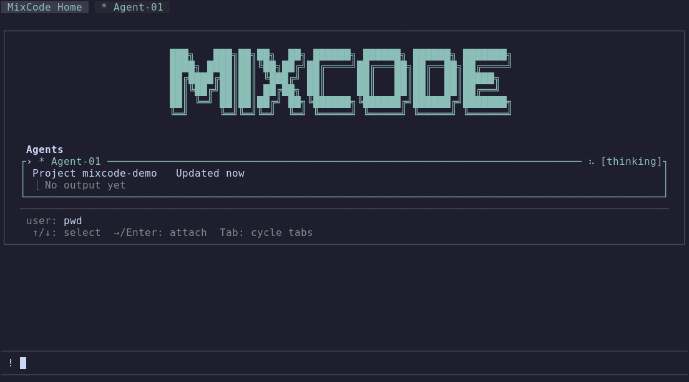

# MixCode Pi

A terminal-native AI coding agent.

<p align="center">
  
</p>

## Features

- **Multi-tab sessions** — run multiple agent conversations in parallel, switch freely between them
- **Agent View** — observe what the agent is doing in real time, send messages mid-task
- **Pi extension compatible** — works with the full Pi extension ecosystem out of the box

## Install

Requires [Bun](https://bun.sh):

```bash
./install.sh              # installs to ~/.local/bin/mixcode-pi
./install.sh --prefix /opt/mixcode  # custom prefix
```

This compiles a self-contained single binary via `bun build --compile`. No Node.js or node_modules needed at runtime.

## Usage

```bash
mixcode-pi                             # start in the current directory
mixcode-pi --workdir ~/project         # start in a specific directory
mixcode-pi --builtin-extensions-only   # load only MixCode built-in extensions
```

`--builtin-extensions-only` disables only third-party Pi extensions; skills, prompts, themes, and context files continue to load from the existing configuration.

## Configuration

See [`mixcode_settings.json`](docs/mixcode-settings.md) for supported local settings.

Batch Lua scripts: [`docs/batch-lua.md`](docs/batch-lua.md).

---

[中文文档](README.zh.md)
