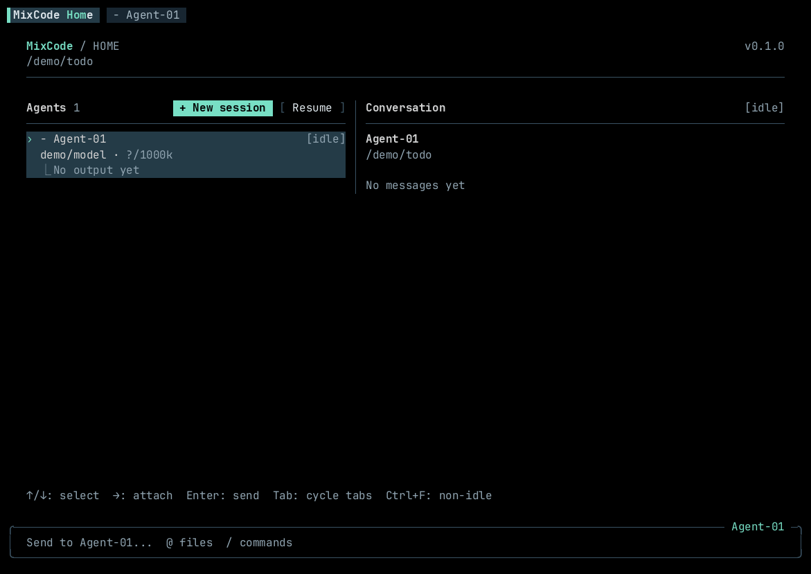
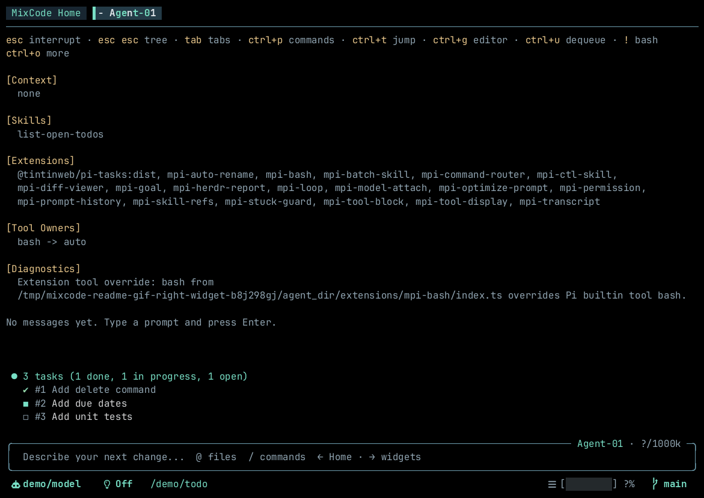
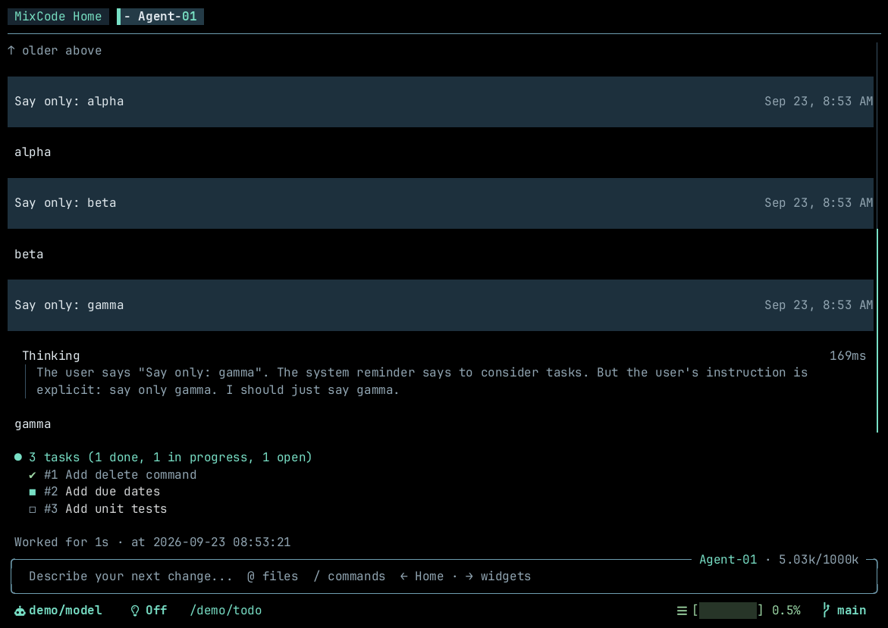
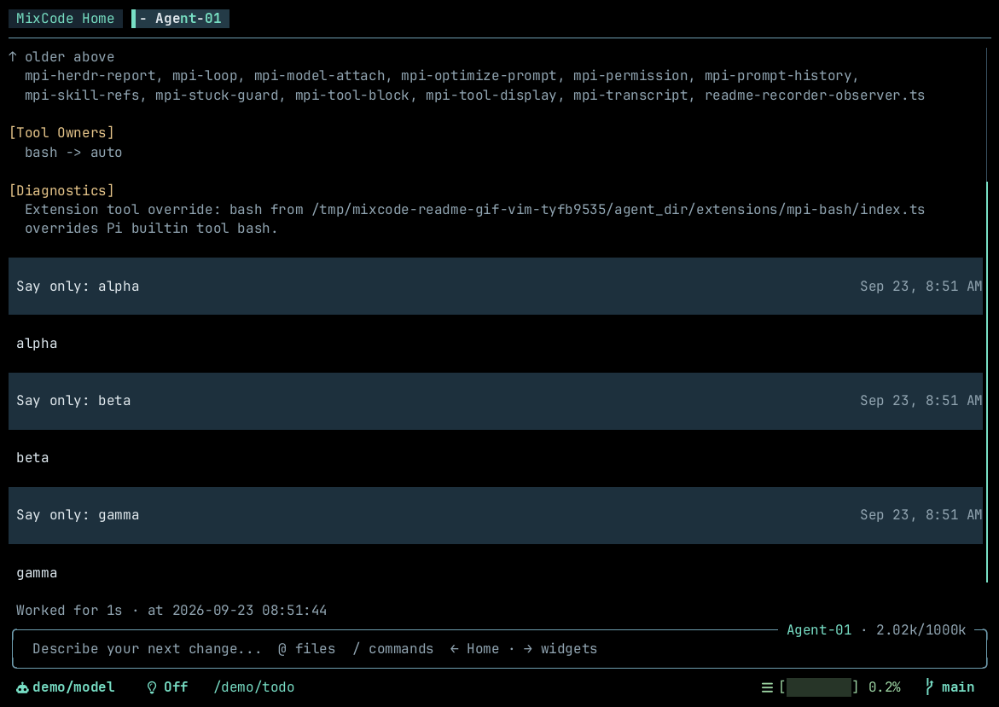
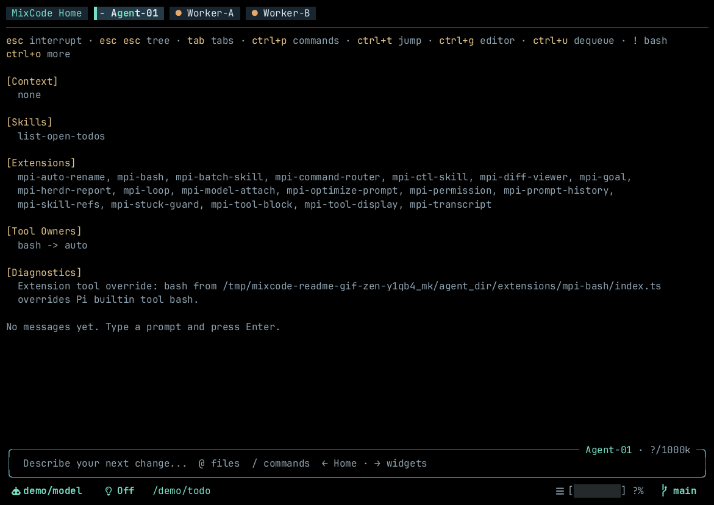
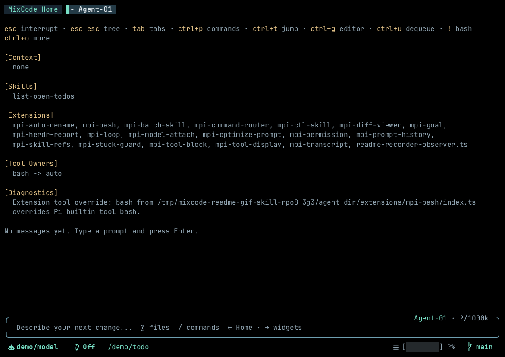
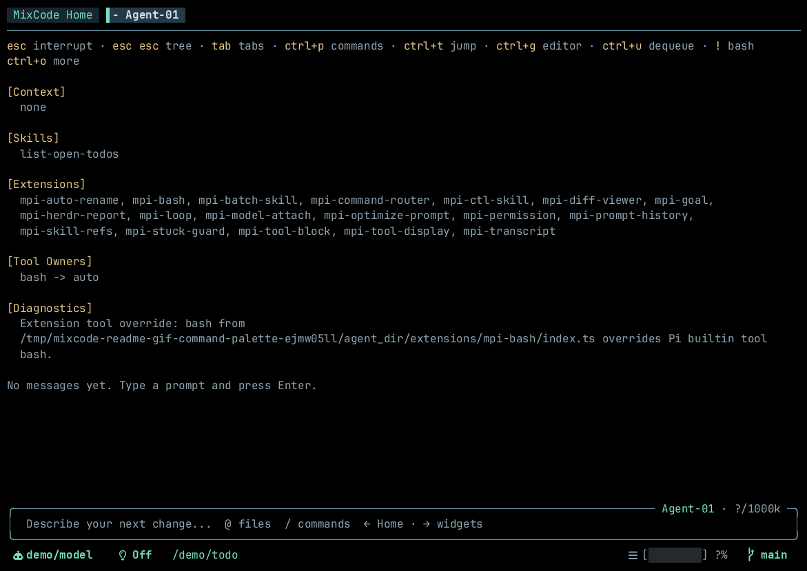

# MixCode Pi (`mpi`)

[中文文档](README.zh.md)

A **multi-tab**, terminal-native AI coding agent fully compatible with the [Pi](https://pi.dev) extension ecosystem. Pi is an open, extensible terminal AI coding agent; MixCode runs its entire package ecosystem natively.

<p align="center">
  <a href="LICENSE"></a>
  <a href="package.json"></a>
  <a href="https://bun.sh"></a>
  <a href="https://pi.dev"></a>
</p>

<p align="center">
  
</p>

> **Why MixCode Pi?**
> Standard AI coding agents lock your terminal to a single session; you cannot explore, review, or run parallel tasks while the model is thinking. MixCode adds native multi-tab concurrency, Agent Tab collaboration, and full Pi extension compatibility: run multiple agents side by side, send work between tabs, organize workspaces across restarts, and use the full Pi package catalog (`npm:…`, tools, widgets, and commands).

## Highlights

- **Native multi-tab concurrency.** Run multiple agent sessions side by side with live status indicators.
- **Agent Tab collaboration.** Tabs send each other prompts, wait, and collect replies (`mpi ctl`).
- **Pi extension compatibility.** Runs the full Pi package catalog plus first-party `mpi-*` extensions.
- **Zen & inline modes.** Hide chrome for a distraction-free view, or move widgets into the chat stream.
- **Mobile & touch optimized.** Narrow terminals, split panes, and touch-friendly SSH clients (Termux, iOS Blink).
- **Terminal-first workflow.** Vim-style transcript navigation, command palette, `$skill` / `@file` / `@tab` autocomplete.
- **Declarative batch automation.** Script multi-agent workflows in Lua or TypeScript, with dry-run validation.

---

## Quick start

Requires [Bun](https://bun.sh). Install via clone and build script:

```bash
git clone https://github.com/cyril0124/mixcode-pi.git
cd mixcode-pi
./install.sh
mpi
```

Or run `bun run install:global` inside the cloned directory if you prefer linking the development source. Ensure `~/.local/bin` (or `~/.bun/bin` for linked source) is on your `PATH`. Upgrade via `git pull && ./install.sh`.

Models and credentials use Pi's standard config: `~/.pi/agent/models.json` (models & custom endpoints) and `auth.json` (API keys). For built-in providers just run `/login` inside `mpi` (or `pi`) and authenticate via subscription OAuth or an API key; no manual config needed. Credentials are shared with Pi, so an existing Pi setup is picked up as-is; see [Model Management](docs/model-management.md).

---

## Key features

### 1. Multi-tab workspaces & session coordination
Run isolated agent sessions side by side. Switch with `Tab` / `Shift+Tab` or fuzzy jump via `Ctrl+T`; background tabs show live status indicators (`●` running, `!` unread, `x` error). Each tab maintains an independent conversation tree, tool runtime, and working directory. Workspaces persist tab layouts across restarts, while atomic file locks (`open_tabs.json.lock`) coordinate tabs across multiple terminal windows or tmux panes.

### 2. Agent Tab collaboration
Tabs talk to each other, in the same TUI or another `mpi`, without stealing the keyboard. One tab delegates a review or verification to a peer, waits, and reads the reply. The built-in `mpi-ctl` skill exposes `mpi status` / `mpi ctl` to the agent's bash tool. CLI loop: [Agent Tab Collaboration](#agent-tab-collaboration).

### 3. Full Pi ecosystem & built-in extensions
Install community extensions directly through Pi package declarations (`settings.json` `packages`, e.g. `npm:pi-web-access`), including custom tools, widgets, and themes, or use MixCode's first-party `mpi-*` tools:
- **`mpi-goal`**: Long-running goal tracking with dynamic progressive tool loading.
- **`mpi-diff-viewer`**: In-terminal visual diffs with line-level review comments (`/diff`).
- **`mpi-loop`**: Recurring prompt scheduling with conflict handling (`/loop 5m /review`).
- **`mpi-optimize-prompt`**: Metaprompt-based prompt expansion.
- **`mpi-auto-rename`**: Context-derived session titles (`/auto-rename`).
- **`mpi-ctl`**: Multi-agent / cross-tab collaboration (`mpi status`, `mpi ctl`).
- **`mpi-permission`**: Fine-grained tool execution permission rules (`/permission`).
- **`mpi-transcript`**: View effective LLM context, chatlog, thinking, and latest replies in nvim, vim, or the in-app viewer; configure with `/transcript config`.
- **`mpi-prompt-history`**: Prompt recall log and interactive browser (`/prompt-history`).
- **`mpi-tool-block`**: Selectively hide tools from model context (`/tool-block`).
- **`mpi-tool-display`**: Compact terminal transcript presentation for tools and thinking.
- **`mpi-model-skills` / `mpi-model-extensions`**: Per-model skill and extension dynamic switching.
- **`mpi-skill-refs`**: `$skill` autocomplete and prompt expansion.
- **`mpi-search-guard`**: Directory-scoped search protection for safe workspace navigation.
- **`mpi-length-resume`**: Auto-continue after length-truncated answers (post-compact and settled-run resume).
- **`mpi-herdr-report`**: Real-time status reporting to Herdr agent panes (`HERDR_ENV=1`).
- **`mpi-image-hoist`**: Lift image paths into native multimodal message parts.
- **`mpi-bash`**: Default bash timeout plus a foreground window that detaches long commands to the background and reports their exit code when they finish; `/bash-logs` opens any background command's full log.

<p align="center">
  
</p>

### 4. Inline & docked extension widgets
Switch dynamically between docked editor widgets and inline chat-stream widgets using `/toggle-inline-widgets`. In inline mode, widgets follow transcript scrolling rather than taking up fixed vertical editor space.

<p align="center">
  
</p>

### 5. Vim navigation
Treat the conversation transcript as a Vim buffer: scroll line-by-line (`j`/`k`), page with `Ctrl+U` / `Ctrl+D`, and jump between milestone user turns (`Right` / `Shift+Right`). Enter via `/vim` or empty-queue `Ctrl+U` then `u`.

<p align="center">
  
</p>

### 6. Zen mode & ambient status
Hide the top tab bar for a distraction-free view (`/toggle-zen-mode`). Background agents with notable state changes (running, waiting for input, error, done) render as compact status dots (`●`) on the top border.

<p align="center">
  
</p>

### 7. In-prompt skill references & autocomplete
Type `$` in the prompt editor to trigger fuzzy autocomplete for project, global, and installed package skills, automatically embedding skill instructions into the prompt payload.

<p align="center">
  
</p>

### 8. Command palette
Press `Ctrl+P` to fuzzy search and execute slash commands, model switches, and extension actions for the current tab context.

<p align="center">
  
</p>

---

## Keyboard shortcuts

Core keys only. Open **Help** or the Command Palette in-app for the full map:

| Key | Scope | Action | Description |
|---|---|---|---|
| `Tab` / `Shift+Tab` | Global | Next / Previous Tab | Cycle tabs. No-op when autocomplete is open or Zen mode is on (use `Ctrl+T`). |
| `Ctrl+P` | Global | Command Palette | Fuzzy search and run slash commands. |
| `Ctrl+T` | Global | Tab Jump | Interactive modal to jump to any open tab. |
| `Ctrl+G` | Global | External Editor | Edit current draft in `$VISUAL` / `$EDITOR`. |
| `Ctrl+Q` | Global | Quit | Safely persists workspace state and exits. |
| `Ctrl+U` | Input / Queue | Dequeue / Choose / Vim | Pops the sole non-empty queue; when both contain messages, use `Ctrl+U,S/F`; when empty, arms Vim entry. See [queue management](docs/queue-and-follow-up.md). |
| `Right` | Empty Input | Side Panel | Toggle right-hand extension widget panel. |
| `Escape` | Global | Smart Escape | Close overlay → exit Vim → abort/retract prompt. |
| `!` | Editor | Bash Command | Single-line shell execution mode. |
| `$` | Editor | Skill Autocomplete | Trigger project, global, and installed package skill completion. |
| `@` | Editor | File / Tab Autocomplete | Complete workspace file paths and peer tab titles. |

---

## Installation

### Recommended: standalone binary (via git clone)

```bash
git clone https://github.com/cyril0124/mixcode-pi.git
cd mixcode-pi
./install.sh                 # standalone binary → ~/.local/bin/mpi
./install.sh --prefix /opt/mixcode
```

Upgrade by running `git pull && ./install.sh` in the repository directory.

### From a local checkout (development / linked)

```bash
bun run install:global       # global `mpi` linked from this repo
```

- `./install.sh` compiles a single standalone binary (`bun build --compile`); no `node_modules` needed at runtime.
- `bun run install:global` runs from this repository via the linked Bun runtime.

---

## Usage

```bash
mpi                             # Start in current directory
mpi --workdir ~/project         # Start in specific directory
mpi --builtin-extensions-only   # Disable 3rd-party packages; load only mpi-*
mpi --batch script.ts           # Run batch automation script (.lua or .ts)
mpi status                      # Inspect running instances and tab states
```

## Agent Tab Collaboration

An agent tab drives its own TUI, or any other `mpi`, with `mpi status` / `mpi ctl`. Send a prompt or slash command to a peer tab, wait for completion, read the result. Target another directory with `--pid` / `--workdir`.

Typical uses:

- Hand a review, a question, or a long job to another tab and read the reply.
- Split independent work across tabs and collect the results.
- Talk to a tab in another `mpi` instance (`--pid` / `--workdir`).

```bash
mpi status --json                        # List live instances, tabs, states
mpi ctl --tab Agent-01 send-prompt '/compact'
mpi ctl --workdir ~/other-proj --tab Reviewer send-prompt 'review the diff'
mpi ctl --tab Agent-01 wait && mpi ctl --tab Agent-01 last-message
```

This is how `mpi` develops `mpi`: one tab delegates review or verification tasks to tabs of other instances and collects their replies. Full command reference: [pi-packages/mpi-ctl/skills/mpi-ctl/SKILL.md](pi-packages/mpi-ctl/skills/mpi-ctl/SKILL.md). At runtime the skill is installed at `<agentDir>/extensions/mpi-ctl/skills/mpi-ctl/SKILL.md`, `~/.pi/agent/…` by default.

Inspired by [Herdr](https://herdr.dev), a terminal multiplexer for coding agents that exposes session control to the agents running inside it.

---

## Documentation

Full architectural specifications, guides, and manuals are available in the [`docs/`](docs/README.md) directory:

- [System Architecture](docs/architecture.md)
- [TUI Components & Layout](docs/tui-components.md)
- [Multi-Tab Workspaces](docs/workspace-and-tabs.md)
- [Model Management](docs/model-management.md)
- [Steering & Follow-up Queues](docs/queue-and-follow-up.md)
- [Zen Mode](docs/zen-mode.md)
- [Inline Widgets Mode](docs/inline-widgets.md)
- [Vim Mode & Navigation](docs/vim-and-navigation.md)
- [Batch Script Automation](docs/batch-scripts.md)
- [Pi Extension Compatibility](docs/extension-compatibility.md)
- [Slash Commands Reference](docs/commands.md)
- [MixCode Settings](docs/mixcode-settings.md)
- [Environment Variables](docs/environment.md)
- [Instance Registry & Monitoring](docs/instance-registry.md)

---

## About this project

This is an AI-developed project. My daily development now happens entirely in `mpi`, including developing `mpi` itself. The code quality may be poor, but please experience `mpi` for yourself.

Not interested in this project? Take a look at [`pi-packages/`](pi-packages/) instead, a set of high-quality Pi extensions that also work on plain [Pi](https://pi.dev).

Licensed under the [MIT License](LICENSE).

## Acknowledgements

- [Pi](https://pi.dev) by Mario Zechner ([earendil-works/pi](https://github.com/earendil-works/pi)). MixCode is built on Pi's agent core, extension system, and TUI toolkit (`pi-coding-agent`, `pi-tui`, `pi-ai`, `pi-agent-core`). Its clean SDK and open extension ecosystem are what make a project like this possible.
